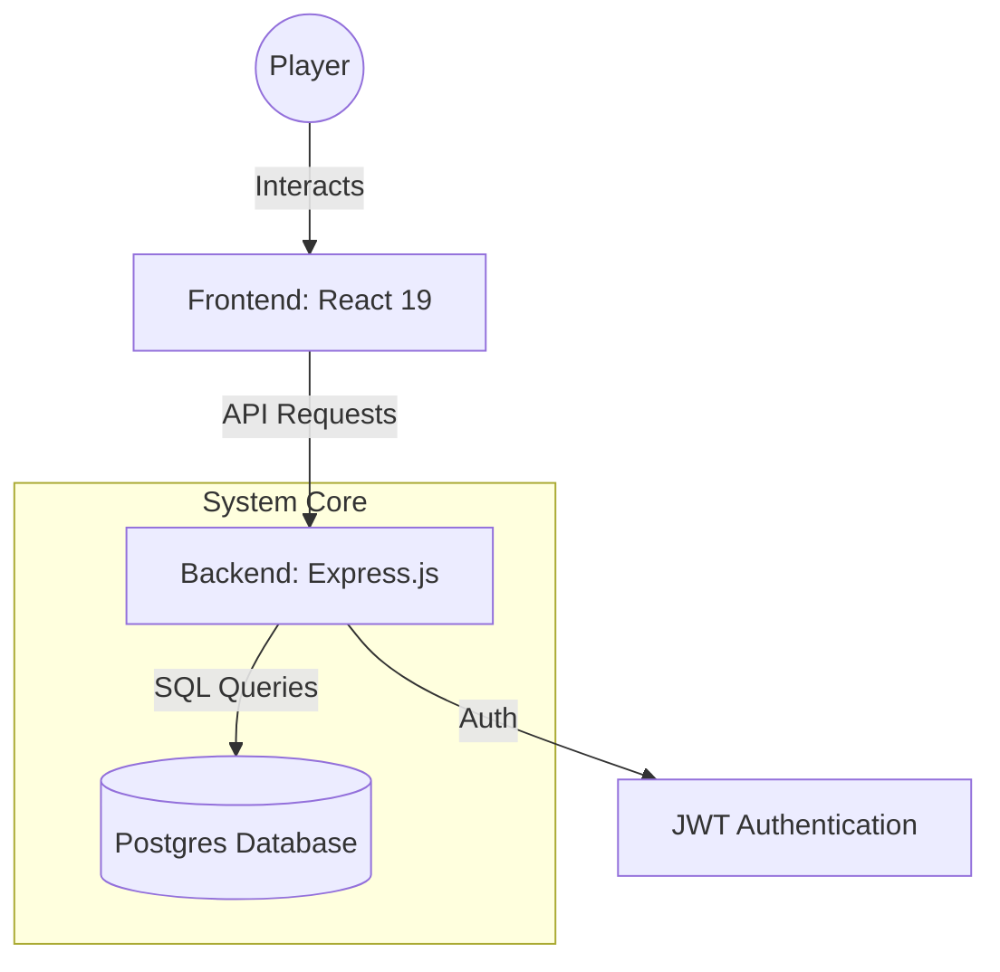

<div align="center">
  <br/>
  <h1>🔱 HUNTER SYSTEM 🔱</h1>
  <p><i>"The only thing that matters in this world is power. And the System is the key to obtaining it."</i></p>

  [](https://github.com/yuvaraj/hunter-system)
  [](https://github.com/yuvaraj/hunter-system)
  [](LICENSE)
</div>

---

## 📖 THE AWAKENING

Welcome, Player. You have been selected by **The System** to undergo a transformation. The **Hunter System** is a Solo Leveling-inspired life RPG gamification platform that turns your real-life tasks, habits, and goals into an epic quest for power.

Stop living as an NPC. Awakening starts now.

## ⚔️ CORE SYSTEM MECHANICS

### 📜 Quest Board
Manage your daily responsibilities as high-stakes missions. Complete them to earn **XP**, **Gold**, and **Stat Points**.
- **Daily Quests**: Recurring tasks to build discipline.
- **Side Quests**: One-off tasks for extra rewards.
- **Main Quests**: Critical milestones that shape your destiny.

### 👹 Boss Raids
Turn your massive long-term goals into epic boss battles. Each goal has a health bar—chip away at it by making progress until the boss is defeated.

### 📈 Player Evolution
- **Hunter Stats**: Track your real-life progress in **STR**, **INT**, **AGI**, **VIT**, **END**, and **SEN**.
- **Leveling**: Accumulate XP to rank up from E-Class all the way to Sovereign status.
- **Skill Tree**: Unlock powerful abilities as you grow.

### 🎒 Inventory & Rewards
Spend your hard-earned Gold in the **Item Shop** to purchase rewards and manage your inventory of achievements.

---

## 🛠️ THE ARCHITECTURE

The Hunter System is built with a powerful, containerized stack designed for speed and reliability.



### 🧬 Tech Stack
| Component | Rank | Technology |
|---|---|---|
| **Frontend** | S-Class | React 19, Vite, TailwindCSS v4, Motion |
| **Backend** | A-Class | Node.js, Express, TypeScript |
| **Database** | S-Class | PostgreSQL 15 |
| **Orchestration**| A-Class | Docker & Docker Compose |

---

## 🚀 AWAKENING PROCEDURE (SETUP)

### 1. Prerequisites
Ensure you have the following reagents installed:
- [Docker](https://docs.docker.com/get-docker/)
- [Docker Compose](https://docs.docker.com/compose/install/)

### 2. Prepare the Environment
Create a `.env` file in the root directory:
```bash
# Database Config
DB_NAME=hunter_system
DB_USER=hunter
DB_PASSWORD=hunter_pass
DB_PORT=5433

# API Config
JWT_SECRET=your-secret-key-change-this
PORT=3001
```

### 3. Initiate System Startup
Run the following command to ignite the engines:
```bash
docker compose up --build
```
> [!IMPORTANT]
> The specialized **`init.sql`** script will automatically manifest all 12 required database tables upon the first successful boot.

### 4. Access the Interface
- **Frontend HUD**: [http://localhost:3005](http://localhost:3005)
- **Backend API**: [http://localhost:3001](http://localhost:3001)

---

## 🗺️ PROJECT BLUEPRINT

```text
hunter-system/
├── frontend/           # The Player Interface (React 19)
├── backend/            # The System Core (Express + TS)
│   ├── src/routes/     # API Gateways
│   └── sql/            # Database Manifest (init.sql)
├── docs/               # Sacred Texts & Documentation
└── docker-compose.yml  # System Orchestrator
```

---

## 🛡️ CREDITS & LICENSE

The Hunter System is open-sourced under the **MIT License**. Inspired by the legendary works of **Chugong**.

*Remember: Only the strong survive. Keep leveling up.*
