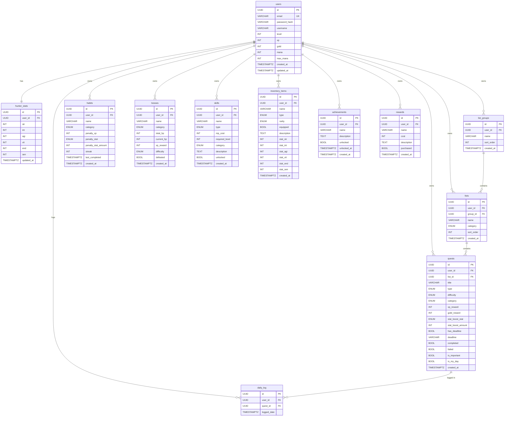

# Hunter System — Database Schema

## Overview

The Hunter System uses PostgreSQL with 12 tables, designed for Supabase-ready migration. All tables use UUID primary keys, TIMESTAMPTZ timestamps, and PostgreSQL enums for constrained types.

---

## Entity Relationship Diagram

---

## Custom PostgreSQL Enums

| Enum | Values |
|------|--------|
| `quest_type` | DAILY, MAIN, SIDE, PENALTY, EMERGENCY |
| `difficulty_rank` | E, D, C, B, A, S |
| `category` | FITNESS, STUDY, WORK, HEALTH, SOCIAL, CREATIVITY |
| `item_rarity` | Common, Rare, Epic, Legendary |
| `item_type` | Weapon, Armor, Consumable, Rune, Artifact |
| `skill_type` | ACTIVE, PASSIVE |
| `stat_name` | STR, INT, AGI, VIT, END, SEN |

---

## Indexes

| Index | Table | Column(s) |
|-------|-------|-----------|
| `idx_users_email` | users | email |
| `idx_hunter_stats_user` | hunter_stats | user_id |
| `idx_list_groups_user` | list_groups | user_id |
| `idx_lists_user` | lists | user_id |
| `idx_quests_user` | quests | user_id |
| `idx_quests_status` | quests | user_id, completed, failed |
| `idx_habits_user` | habits | user_id |
| `idx_bosses_user` | bosses | user_id |
| `idx_skills_user` | skills | user_id |
| `idx_inventory_user` | inventory_items | user_id |
| `idx_achievements_user` | achievements | user_id |
| `idx_rewards_user` | rewards | user_id |
| `idx_daily_log_user` | daily_log | user_id |

---

## Triggers

- **`trigger_users_updated_at`** — Automatically updates `updated_at` on `users` table before each UPDATE
- **`trigger_stats_updated_at`** — Automatically updates `updated_at` on `hunter_stats` table before each UPDATE

---

## Supabase Migration Notes

This schema is designed for **zero-friction Supabase migration**:

1. **UUID primary keys** — Supabase default
2. **No ORM** — Raw SQL via `pg` client, identical to Supabase `supabase-js` patterns
3. **RLS-ready** — Every table has `user_id` FK for Row-Level Security policies
4. **Auth-compatible** — JWT auth maps directly to Supabase Auth
5. **Migration path**: Point `DATABASE_URL` to Supabase and import `init.sql`

---

## Full SQL Init Script

See: [`backend/sql/init.sql`](../backend/sql/init.sql)
